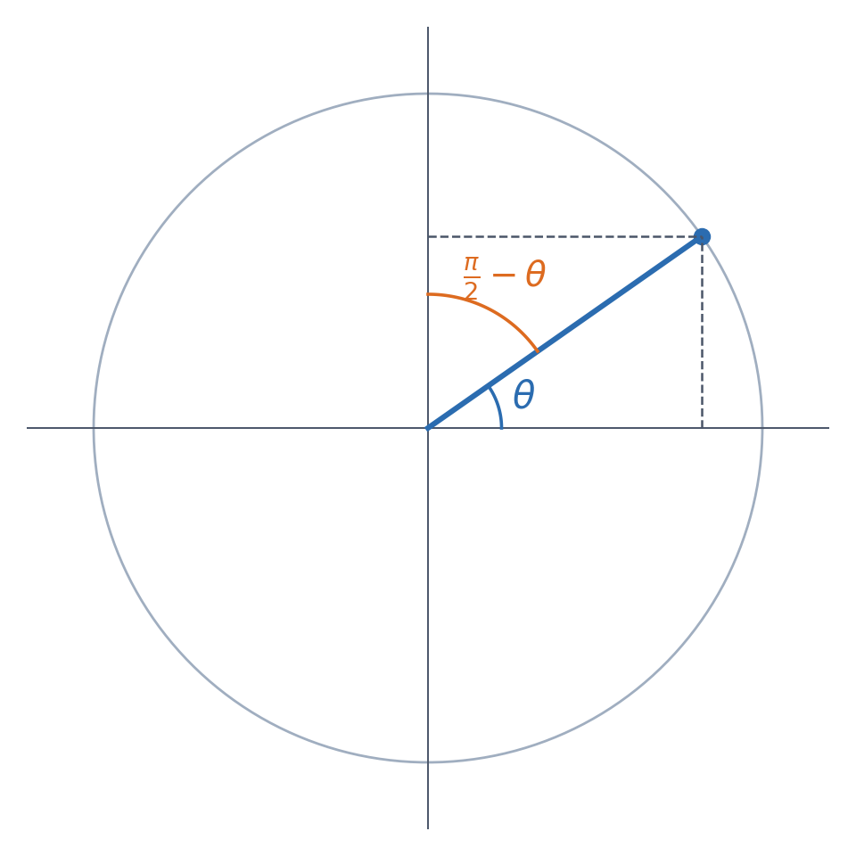

基本函數的導函數清單背起來不難，但如果只是死記，很容易搞混哪個要加負號、哪個不用。這篇文章先把常數函數、冪函數、絕對值函數、指對數函數、三角函數與反三角函數的導函數整理成一張速查表，再說明表格背後的規律其實不是隨機的巧合，而是能從函數之間的關係直接推出來的。

## 常數函數與冪函數

$$\frac{\mathrm d}{\mathrm dx}\bigl(c\bigr)=0 \qquad\qquad \frac{\mathrm d}{\mathrm dx}\bigl(x^p\bigr)=p\cdot x^{p-1}\quad(\forall p\in\mathbb R)$$

常數函數微分可以看作是冪函數當指數為 $0$ 的特例。

## 絕對值函數

$$\frac{\mathrm d}{\mathrm dx}\bigl(|x|\bigr)=\frac{x}{|x|}\ (x\neq0) \qquad\qquad \frac{\mathrm d}{\mathrm dx}\bigl(|f(x)|\bigr)=\frac{f(x)}{|f(x)|}\cdot f'(x)\ (f(x)\neq0)$$

右側 $|f(x)|$ 的微分可以看作是 $|x|$ 微分再套用連鎖律。

## 三角函數

| 函數 | 導函數 | 函數 | 導函數 |
| :--- | :--- | :--- | :--- |
| $\sin x$ | $\cos x$ | $\cos x$ | $-\sin x$ |
| $\tan x$ | $\sec^2x$ | $\cot x$ | $-\csc^2x$ |
| $\sec x$ | $\sec x\tan x$ | $\csc x$ | $-\csc x\cot x$ |

左欄與右欄互為「co-」搭檔，右欄（帶 co- 開頭）的導函數都比左欄多一個負號——這個規律的原因在下面說明。

## 反三角函數

| 函數 | 導函數 | 函數 | 導函數 |
| :--- | :--- | :--- | :--- |
| $\arcsin x$ | $\dfrac{1}{\sqrt{1-x^2}}$ | $\arccos x$ | $-\dfrac{1}{\sqrt{1-x^2}}$ |
| $\arctan x$ | $\dfrac{1}{1+x^2}$ | $\operatorname{arccot}x$ | $-\dfrac{1}{1+x^2}$ |
| $\operatorname{arcsec}x$ | $\dfrac{1}{|x|\sqrt{x^2-1}}$ | $\operatorname{arccsc}x$ | $-\dfrac{1}{|x|\sqrt{x^2-1}}$ |

同樣地，右欄的反三角函數導函數，都恰好是左欄對應導函數的相反數。

## 餘角函數的負號

三角函數裡，$\cos,\cot,\csc$ 這三個帶「co-」（complementary，餘角）開頭的函數，它們的導函數都恰好比對應的 $\sin,\tan,\sec$ 多一個負號——這個負號並不是巧合，而是「co-」這個字首本身的意義直接造成的結果。「co-」代表的是餘角關係：$\cos\theta=\sin\left(\dfrac\pi2-\theta\right)$，同樣地 $\cot\theta=\tan\left(\dfrac\pi2-\theta\right)$、$\csc\theta=\sec\left(\dfrac\pi2-\theta\right)$——每一個「co-」函數，都是對應函數在「餘角」處的值。

現在對 $\cos\theta=\sin\left(\dfrac\pi2-\theta\right)$ 兩邊用連鎖律微分：內層 $\dfrac\pi2-\theta$ 對 $\theta$ 微分是 $-1$，所以

$$\cos'\theta=\cos\left(\frac\pi2-\theta\right)\cdot(-1)=-\sin\theta$$

（最後一步用到 $\cos\left(\frac\pi2-\theta\right)=\sin\theta$，也是餘角關係。）同樣的推導對 $\cot\theta=\tan\left(\frac\pi2-\theta\right)$ 跟 $\csc\theta=\sec\left(\frac\pi2-\theta\right)$ 都成立：每一次微分「co-」函數，連鎖律都會從內層的 $\left(\frac\pi2-\theta\right)'=-1$ 貢獻一個負號出來，而外層微分完之後，恰好又會變回它的「co-」搭檔。這就是為什麼「co-」開頭的函數，微分永遠比對應的函數多一個負號——它不是六個獨立要背的規則，而是同一個餘角關係、加上連鎖律，重複用了三次的結果。

## 指數與對數函數

$$\frac{\mathrm d}{\mathrm dx}\bigl(a^x\bigr)=a^x\ln a \qquad\qquad \frac{\mathrm d}{\mathrm dx}\bigl(\log_ax\bigr)=\frac{1}{x\ln a}$$

指數與對數的微分，也可以看成是從一個最基本的結果不斷延伸出來的。起點是自然指數函數的性質：$(e^x)'=e^x$——這是所有指數、對數微分規則的源頭，也是 $e$ 這個數之所以特殊的原因之一。

**拓展到一般底數的指數函數**：任何指數函數都能透過自然對數改寫成以 $e$ 為底，$a^x=e^{x\ln a}$（其中 $\ln a$ 是一個常數）。對這個式子用連鎖律微分：

$$\left(a^x\right)'=\left(e^{x\ln a}\right)'=e^{x\ln a}\cdot(x\ln a)'=e^{x\ln a}\cdot\ln a=a^x\ln a$$

也就是說，一般底數指數函數的微分，只是在 $e^x$ 的基礎上多乘了一個常數 $\ln a$——這個常數正是把 $e$ 換成 $a$ 所需要付出的「代價」。

**拓展到自然對數**：$\ln x$ 是 $e^x$ 的反函數，用反函數微分定理（$f^{-1}$ 的導函數等於 $\dfrac{1}{f'(f^{-1}(x))}$）：

$$\left(\ln x\right)'=\frac{1}{e^{\ln x}}=\frac1x$$

**再拓展到一般底數的對數函數**：$\log_a x$ 是 $a^x$ 的反函數，同樣用反函數微分定理：

$$\left(\log_ax\right)'=\frac{1}{\left(a^x\right)'\big|_{x=\log_ax}}=\frac{1}{a^{\log_ax}\ln a}=\frac{1}{x\ln a}$$

（最後一步用到 $a^{\log_ax}=x$。）整條拓展的路徑是：$(e^x)'=e^x$ 這一個結果，先靠著「改寫成以 $e$ 為底」拓展到任意底數的指數函數，再分別靠「反函數微分」拓展到自然對數，最後拓展到任意底數的對數函數——四個看似獨立的公式，其實只用到兩個工具（改寫底數、反函數微分），反覆套用在同一個起點上而已。

## 規律比公式重要

上面的表格建議搭配「微分運算定理與連鎖律」一起使用：遇到的函數如果不是表格裡列出的基本函數，而是好幾個基本函數經過加減乘除或合成組合出來的結果，就需要先把運算定理套進去，把問題拆解成表格裡查得到的基本導函數，再組合回去——這張表的角色，是提供「積木」本身，而不是教怎麼把積木組裝起來。

但比起把六、七條公式一條一條背下來，更值得記住的是兩件事：帶「co-」的三角函數，其實都是對應函數在餘角處的值，微分時連鎖律會自動生出負號；而指數、對數之間，則是靠著換底公式跟反函數微分定理，從 $(e^x)'=e^x$ 這一個最基本的事實，一路推廣出其餘所有結果。記住規律本身，遇到不確定的公式時，也能自己重新推導一次，而不必單靠記憶。
